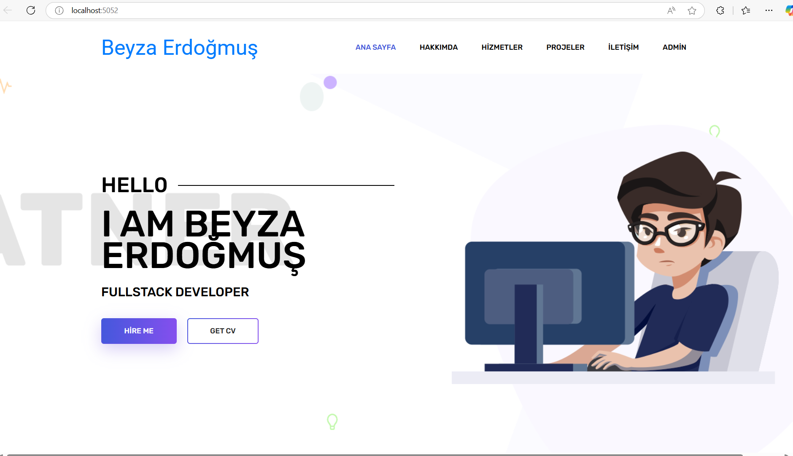

## Portfolio Application

### 🚀Overview

This project is a basic portfolio application designed to showcase projects and achievements. The application is built using modern technologies and adheres to the principles of clean architecture and maintainable code.

### 🛸Features

Display portfolio projects with detailed descriptions.

Admin panel for managing portfolio content.

Responsive and user-friendly interface.

### 📣Technologies Used

Entity Framework Core: For database operations and ORM.

MVC (Model-View-Controller): For a structured and scalable architecture.

N-Layer Architecture: For separation of concerns and maintainability.

MSSQL: As the database management system.

Admin Template: Pre-designed UI for the admin panel, ensuring a polished and consistent experience.

